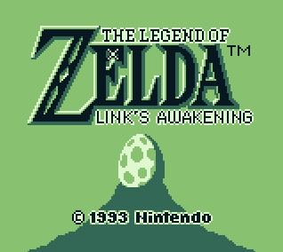

A simple GB emulator written for fun in Go.

## Current test ROMs status

### Blargg's

|Name          |Error report / remark |                        |
|--------------|----------------------|------------------------|
|cpu_instrs    |                      |:heavy_check_mark:      |
|instr_timing  |`Failed #255`         |:heavy_multiplication_x:|
|interrupt_time|`Failed`              |:heavy_multiplication_x:|
|mem_timing    |Never finishes 01     |:heavy_multiplication_x:|
|mem_timing-2  |Never finishes 01     |:heavy_multiplication_x:|

### Mooneye's

|Name                            |Error report / remark                                      |                        |
|--------------------------------|-----------------------------------------------------------|------------------------|
|bits/mem_oam                    |                                                           |:heavy_check_mark:      |
|bits/reg_f                      |                                                           |:heavy_check_mark:      |
|bits/unused_hwio-GS             |                                                           |:heavy_check_mark:      |
|bits/unused_hwio-C              |                                                           |:heavy_check_mark:      |
|instr/daa                       |                                                           |:heavy_check_mark:      |
|interrupts/is_push              |`R1: not cancelled`                                        |:heavy_multiplication_x:|
|oam_dma/basic                   |                                                           |:heavy_check_mark:      |
|oam_dma/reg_read                |                                                           |:heavy_check_mark:      |
|oam_dma/sources-dmgABCmgbS      |                                                           |:heavy_check_mark:      |
|ppu/hblank_ly_scx_timing-GS     |`TEST FAILED`                                              |:heavy_multiplication_x:|
|ppu/intr_1_2_timing-GS          |`D: 14!, E: 15!`                                           |:heavy_multiplication_x:|
|ppu/intr_2_0_timing             |`D: 07!, E: 08!`                                           |:heavy_multiplication_x:|
|ppu/intr_2_mode0_timing         |`D: 01!`                                                   |:heavy_multiplication_x:|
|ppu/intr_2_mode0_timing_sprites |`TEST #00 FAILED`                                          |:heavy_multiplication_x:|
|ppu/intr_2_mode3_timing         |`E: 02!`                                                   |:heavy_multiplication_x:|
|ppu/intr_2_oam_ok_timing        |`E: 02!`                                                   |:heavy_multiplication_x:|
|ppu/lcdon_timing-dmgABCmgbS     |`STAT LYC=0 FAILED, Cycle: $00, Expected: $84, Actual: $87`|:heavy_multiplication_x:|
|ppu/lcdon_write_timing-GS       |`OAM write FAILED, Cycle: $12, Expected: $00, Actual: $81` |:heavy_multiplication_x:|
|ppu/stat_irq_blocking           |`TEST FAILED`                                              |:heavy_multiplication_x:|
|ppu/stat_lyc_onoff              |Never finishes                                             |:heavy_multiplication_x:|
|ppu/vblank_stat_intr-GS         |`B: 01!, D: 01!, E: 00!`                                   |:heavy_multiplication_x:|
|timer/div_write                 |                                                           |:heavy_check_mark:      |
|timer/rapid_toggle              |`B: FF!, C: D9!`                                           |:heavy_multiplication_x:|
|timer/tim00                     |                                                           |:heavy_check_mark:      |
|timer/tim00_div_trigger         |`D: 04!, E: 05!`                                           |:heavy_multiplication_x:|
|timer/tim01                     |                                                           |:heavy_multiplication_x:|
|timer/tim01_div_trigger         |`D: 0A!, E: 0B!`                                           |:heavy_multiplication_x:|
|timer/tim10                     |`D: 04!`                                                   |:heavy_multiplication_x:|
|timer/tim10_div_trigger         |`E: 06!`                                                   |:heavy_multiplication_x:|
|timer/tim11                     |`D: 04!`                                                   |:heavy_multiplication_x:|
|timer/tim11_div_trigger         |`E: 05!`                                                   |:heavy_multiplication_x:|
|timer/tima_reload               |`D: FF!, E: 00!, H: FF!, L: 00!`                           |:heavy_multiplication_x:|
|timer/tima_write_reloading      |`C: FE!, D: 80!`                                           |:heavy_multiplication_x:|
|timer/tma_write_reloading       |`D: 7F!, E: 7F!`                                           |:heavy_multiplication_x:|
|add_sp_e_timing                 |                                                           |:heavy_check_mark:      |
|call_cc_timing                  |                                                           |:heavy_check_mark:      |
|call_cc_timing2                 |`B: 81!, C: 81!, D: 81!`                                   |:heavy_multiplication_x:|
|call_timing                     |                                                           |:heavy_check_mark:      |
|call_timing2                    |`B: 81!, C: 81!, D: 81!`                                   |:heavy_multiplication_x:|
|di_timing-GS                    |`FAIL: ROUND 2`                                            |:heavy_multiplication_x:|
|div_timing                      |                                                           |:heavy_check_mark:      |
|ei_sequence                     |                                                           |:heavy_check_mark:      |
|ei_timing                       |                                                           |:heavy_check_mark:      |
|halt_ime0_ei                    |                                                           |:heavy_check_mark:      |
|halt_ime0_nointr_timing         |`D: 11!, E: 12!`                                           |:heavy_multiplication_x:|
|halt_ime1_timing                |`B: 00!`                                                   |:heavy_multiplication_x:|
|halt_ime1_timing2-GS            |`B: 11!, C: 12!, D: 11!, E: 12!`                           |:heavy_multiplication_x:|
|if_ie_registers                 |                                                           |:heavy_check_mark:      |
|intr_timing                     |                                                           |:heavy_check_mark:      |
|jp_timing                       |                                                           |:heavy_check_mark:      |
|jp_cc_timing                    |Never finishes                                             |:heavy_multiplication_x:|
|ld_hl_sp_e_timing               |                                                           |:heavy_check_mark:      |
|oam_dma_restart                 |                                                           |:heavy_check_mark:      |
|oam_dma_start                   |`B: D7!, C: 01!, D: D7!`                                   |:heavy_multiplication_x:|
|oam_dma_timing                  |                                                           |:heavy_check_mark:      |
|pop_timing                      |                                                           |:heavy_check_mark:      |
|push_timing                     |`D: 81!`                                                   |:heavy_multiplication_x:|
|rapid_di_ei                     |`B: 00!, C: 00!, D: 01!`                                   |:heavy_multiplication_x:|
|ret_cc_timing                   |Graphical artifacts on screen, can't read results          |:heavy_multiplication_x:|
|ret_timing                      |Graphical artifacts on screen, can't read results          |:heavy_multiplication_x:|
|reti_intr_timing                |`B: 01!`                                                   |:heavy_multiplication_x:|
|reti_timing                     |Graphical artifacts on screen, can't read results          |:heavy_multiplication_x:|
|rst_timing                      |`B: 81!`                                                   |:heavy_multiplication_x:|

## Resources

* [http://gbdev.gg8.se/wiki/articles/Pan_Docs](http://gbdev.gg8.se/wiki/articles/Pan_Docs)
* [http://www.pastraiser.com/cpu/gameboy/gameboy_opcodes.html](http://www.pastraiser.com/cpu/gameboy/gameboy_opcodes.html)
* [https://rednex.github.io/rgbds/gbz80.7.html](https://rednex.github.io/rgbds/gbz80.7.html)

## Bundle a ROM

To bundle a ROM with ohboi, name your ROM `bundledROM.gb` and run the following command:

`go-bindata -nometadata -o statics/bindata.go -tags bundle -pkg=statics -ignore=bindata.go bundledROM.gb`
